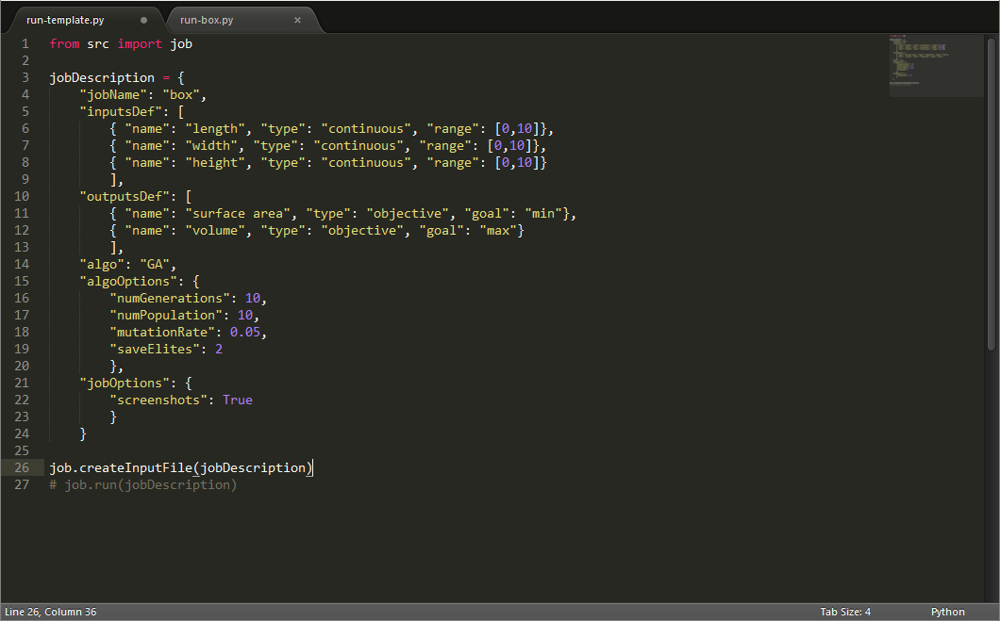

# Discover + Explore
### A flexible[1], modular[2], super light-weight[3] framework for generative design and design space exploration.

1. The framework is designed to be extensible to many different search algorithms, visualization strategies, and other features. Currently only random search and a basic multi-objective genetic algorithm (MOGA) are implemented but more can easily be added following the the structure outlined in this documentation.
2. Various functionalities are broken up into separate script files whenever possible to facilitate learning of all the components that go into modern stochastic metaheuristic algorithms.
3. All code is written with an emphasis on simplicity and readability. The goal is not to develop the fastest or best performing algorithms or code, but to present the functionalities in a way that facilitates learning and accessibility to students and designers with only basic familiarity with coding and programming languages.

## 1. Overview

This project consists of two parts:

1. *Discover* - A modular library for multi-objective optimization written in Python
2. *Explore* - An interface for exploring the optimization process written in JavaScript.


Although *Discover* can be used as a general optimization tool, it is specifically devised for physical design problems, and is thus designed to run alongside a parametric CAD platform such as Rhino/Grasshopper. The Python library communicates with the CAD model using input and output text files that it writes to the local directory. This repository includes example files for Rhino/Grasshopper, but any CAD platform can be used as long as it can write and react to changes in the local text files.

With the CAD model open, an optimization job is started by executing a Python script that launches the job handler and passes to it all the relevant information about the job, including the inputs used by the model, the objectives of the optimization, and any relevant options. When a job is started a subfolder is automatically created to store all the information of that job, including a dataset of all designs explored and optionally a folder of screenshots for each design.

Each job folder also contains an "index.html" file, which is used to launch the *Explore* interface. The file can be directly opened in the Firefox browser (by right-clicking and selecting Open with Firefox), or viewed in any browser using a local server. To make this easier, each job folder also contains a Bash script called `explorer.sh` which will automatically start a local server using Python, and launch *Explorer* in your default browser. If you do not have Bash installed, you can install [git](https://git-scm.com/downloads) which comes with a version of Bash.

## 2. Getting started

To start using *Discover*, all you need is a local copy of this repository. If you are familiar with GitHub, you can fork this repository and clone it to a local folder of your choice. If you don't want to use Github you can simply download the repository by clicking on the green "Clone or download" button above and clicking on "Download ZIP". Then unzip the files to a local folder of your choice.

The repository includes several example files which you can use to test Discover, or modify for your own projects. Each project must have as a minimum a `.gh` Grasshopper file which describes the parametric model, and a `.py` Python script which describes and runs the optimization job. In order for *Discover* to work, both of these files must stay in the main repository folder. The repository includes two template files, `template.gh` and `run-template.py` which you can use as a starting point for your own projects.

These example files rely on a number of Grasshopper libraries which you must install before using the files. You can download the files from the linked websites (you will have to make an account) and follow instructions to install them on your computer:
- [GHPython](http://www.food4rhino.com/app/ghpython) - (required) allows the Grasshopper file to communicate with *Discover*
- [Karamba](http://www.food4rhino.com/app/karamba) - (optional) structural FEA solver used in some example files

## 3. Setting up the model

Start by creating a new Rhino project. Then type 'Grasshopper' to launch the Grasshopper window and load in the `template.gh` file. 


This template file contains a number of nodes that allow it to work with *Discover*. The easiest way to make your Grasshopper file work with *Discover* is to start with this template file. Alternatively, you can also copy and paste these nodes into an existing file.

The first set of nodes [1 in image above] listens for input commands from *Discover*. When a job is running, a list of inputs for each design will be loaded into the 'File' node, and the 'BANG!' node splits them into separate pieces of data that you can plug in as inputs into your model. There is also an additional Python node for unpacking 'series' or 'sequence' type inputs into your model (more on these input types later).

The second set of nodes [2] will load in inputs from a specific design in a previous job. You must supply both a job name and a design ID for the node to work.

The third set of nodes [3] gathers the outputs from your model and sends them to discover. You should connect every output into a separate input of the 'Merge' node.

The four set of nodes [4] controls the automated exporting of screenshots for each design during a job. You don't have to connect anything to these nodes, but have to have them somewhere on your canvas for the screenshot feature to work.

Let's add some nodes to this file to define a simple parametric box model with three input parameters to define the box's length, width, and height, and two outputs that measure the box's surface area and volume. For now we can use sliders to specify the inputs so that we can test the model. We will also connect the two output values to the `Merge` node so that they can be passed to Discover. Make sure you you right click on each input of the `Merge` node and select 'Flatten' to ensure that the model outputs do not get placed on different data branches and that the order of the outputs is maintained (you should see an arrow pointing down next to each of the inputs into the `Merge` node).


## 4. Setting up the job

Now open the `run-template.py` file in a text editor or IDE of your choice. I recommend using [Sublime 2](http://www.sublimetext.com/2), which is a simple, free, and cross-platform text editor which supports syntax highlighting, autocomplete, and can run python scripts directly in the editing window.


This file shows the basic structure for specifying and running a job with Discover. The first line [line 1 above] imports the job library from the 'src' folder. The second part [lines 3-29] specifies all necessary options for running the job, including the data types for the input and output parameters used by the model, as well as options for the general job and the specific search algorithm. 

The template file contains example code for the different data types and options supported by Discover, which you can modify according to your project's needs. Let's modify this definition to specify three continuous input parameters for our box model, as well as two objectives for the surface area and volume of the box. In this case we want to minimize surface area while maximizing volume.



Below the job definition are two lines of code that run the job in Discover. The first line uses the job description to generate a sample input file that can be used to test your Grasshopper setup. The second line runs the actual job. Both of these lines are commented out in the template file so nothing will run by default.

Uncomment the line of code that says:

```python
job.createInputFile(jobDescription)
```

by removing the `#` symbol at the front of the line. In Sublime, you can also press 'Ctrl+/' to comment and un-comment lines. Now run the script to generate a sample input file. You can run the script in Sublime by going to Tools -> Build in the menu bar or by pressing 'Ctrl+B'.

If you now go back to the Grasshopper file you will see that the 'File' node is no longer red because it is able to read the sample input file we just created. You should also see the three input values populating the `DATA IN` panel. To split this data into different streams right-click on the `BANG!` node and select 'Match outputs'. This will create three output nodes, one for each input data. Finally, connect the three data outputs to the three inputs of the `Pt` node that define the box dimensions. Since we are not using a 'series' or 'sequence' type input variable we do not need to use the additional Python node to unpack them. The Grasshopper file is now ready to work with *Discover*, you can save it and keep it open in the background during the next steps.


## 5. Running the job

Now that the model is set up and open in Grasshopper, we can run the job in *Discover*. Go back to the `run-template.py` file we worked on earlier. Now comment out the line that says

```python
job.createInputFile(jobDescription)
```

by placing a `#` in front of it and un-comment the following line that says

```python
job.run(jobDescription)
```

Now run the script again, which should start the job. You should see information about the progress of the current job being displayed at the bottom of the Sublime window. If you go back to the Rhino/Grasshopper window you should also see designs being automatically generated. Note that if you have screenshots enabled, Grasshopper will automatically save a screenshot of whatever is visible in the currently active viewport in Rhino, so make sure that you have this view composed the way you want before starting the job, and you don't change the view while the job is running.


## 6. Exploring results


## Input types


## Output types

## GA options

## License

This software is distributed under the GNU/GPL license. It can be used freely for non-commercial purposes, and may be redistributed as long as attribution is provided back to the original author and any derivative work is given the same license. Please see the [LICENSE](https://github.com/danilnagy/discover/blob/master/LICENSE) document for more information.
