# Discover + Explore
### A flexible[1], modular[2], super light-weight[3] framework for generative design and design space exploration.

1. The framework is designed to be extensible to many different search algorithms, visualization strategies, and other features. Currently only random search and a basic multi-objective evolutionary algorithm (MOEA) are implemented but more can easily be added following the general structure outlined in this documentation.
2. Various functionalities are broken up into separate script files whenever possible to facilitate learning of all the components that go into modern stochastic metaheuristic algorithms.
3. All code is written with an emphasis on simplicity and readability. The goal is not to develop the fastest or best performing algorithms or code, but to present the functionalities in a way that facilitates learning and accessibility to students and designers with only basic familiarity with coding and programming languages.

## 1. Overview

This project consists of two parts:

1. *Discover* - A modular library for multi-objective optimization written in Python
2. *Explore* - An interface for exploring the optimization process written in JavaScript.

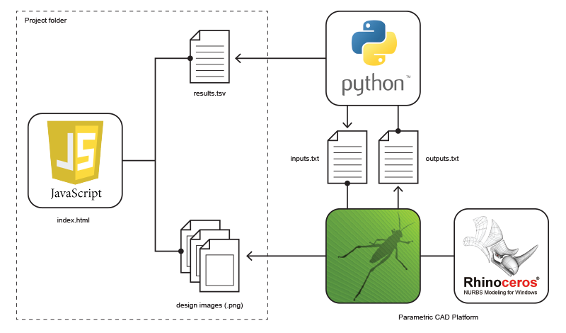

Although *Discover* can be used as a general optimization tool, it is specifically tailored to physical design problems, and is thus designed to run alongside a parametric CAD platform such as Rhino/Grasshopper. The Python library communicates with the CAD model using input and output text files that it writes to the local directory. This repository includes example files for Rhino/Grasshopper, but any CAD platform can be used as long as it can write and respond to changes in the local text files.

With the CAD model open, an optimization job is started by executing a Python script that launches the job handler and passes to it all the relevant information about the job, including the inputs used by the model, the objectives of the optimization, and any relevant options. When a job is started a subfolder is automatically created to store all the information of that job, including a dataset of all designs analyzed and optionally a folder of screenshots for each design. Each job folder also contains an "index.html" file which launches the *Explore* interface for exploring the design space and viewing specific designs analyzed during the optimization job.

## 2. Dependencies

- [Python 2.7](https://www.python.org/downloads/) - Discover is written entirely in Python 2.7. It does not rely on any external Python libraries, but Python 2.7 must be installed on your computer in order for it to run (versions through 2.7.13 have been tested with this release). At this time Python 3 is not supported.
- McNeel's [Rhino 3d](https://www.rhino3d.com/download) design software with [Grasshopper](http://www.grasshopper3d.com/) plugin.
- [GHPython](http://www.food4rhino.com/app/ghpython) - Grasshopper library that allows the Grasshopper file to communicate with *Discover* (version 0.6.0.3 was tested with this release)
- [Karamba](http://www.food4rhino.com/app/karamba) - (optional) structural FEA solver for Grasshopper used in some example files

### 2.1 - Installing Python

You can check if your computer has Python by launching a Command Prompt window, typing in "python" (without quotes), and hitting enter to execute the command. You can find the Command Prompt by going to the start menu and typing in "Command Prompt" or "cmd" in the search field. If you have Python installed you should see Python start, show its version, and display a line beginning with ">>>" where you can start typing Python code:

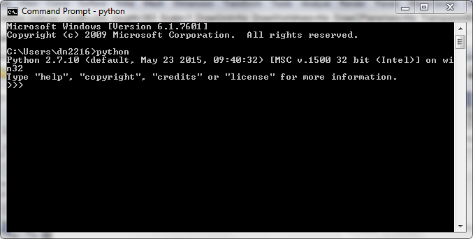

If the version number starts with 2.7 (for example 2.7.10 above) you are good to go. If the version number starts with 3, or the terminal window says something like 

```
'python' is not recognized as an internal or external command, operable program or batch file.
```

please follow the rest of these instructions to install Python 2.7 on your computer.

First, go to https://www.python.org/downloads/ and click on the latest version of Python 2.7 to download the installation file to your computer.

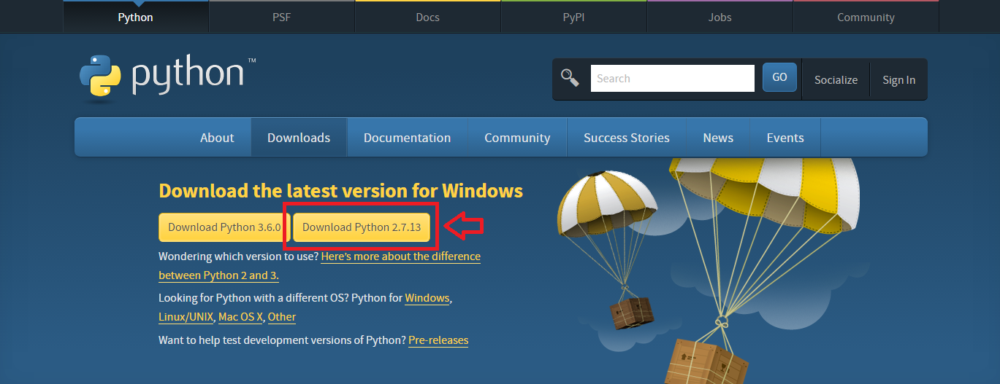

Now run the installer. You can keep all the default settings, but when you get to the second screen ('Customize Python 2.7.X') make sure that you enable the setting to 'Add python.exe to Path' (see screenshot below) by changing the 'X' to 'Will be installed on local hard drive'. This tells the computer where to find the Python executible when you run Python programs.

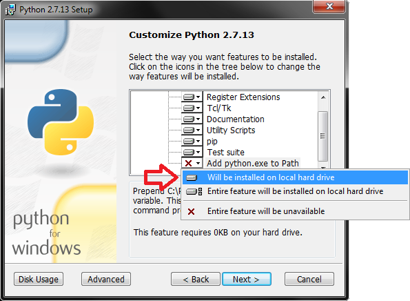

Python 2.7 should now be installed on your computer. You can follow the instructions above to try to run it through the Command Prompt to make sure everything installed correctly. If it doesn't work you can use the installation file to remove Python and try installing again.

### 2.2 - Installing GHPython

GHPython is an external plugin for Grasshopper that allows you to work with Python code directly in Grasshopper by embedding code in special 'Python' nodes. *Discover* uses these nodes to allow Grasshopper models to communicate with the optimization engine. Unfortunately the GHPython library does not come pre-installed with Grasshopper and must be download and installed separately. Luckily this is very easy to do:

First go to http://www.food4rhino.com/app/ghpython and download the latest stable version (you will need to create a free account to download the file). At the time of this writing 0.6.0.3 was the latest version and has been tested to work with *Discover*. You can also find this version of the library in the `/utils` folder of this repo: 

https://github.com/danilnagy/discover/blob/master/utils/ghpython.gha

The library is contained in a single file called ghpython.gha. Once this file is downloaded, right click on it and go to properties. If there is a button or a checkbox in the properties window that says ‘Unblock’, check it or click on it to disable the blocking so that Grasshopper can see the file.

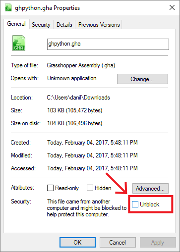

To load the library into Grasshopper you need to put this file into a special ‘Components’ folder where all the libraries are kept. The easiest way to find this folder is to launch Grasshopper and from the menu go to File -> Special Folders -> Components Folder. Now copy and paste the ghpython.gha file into this folder.

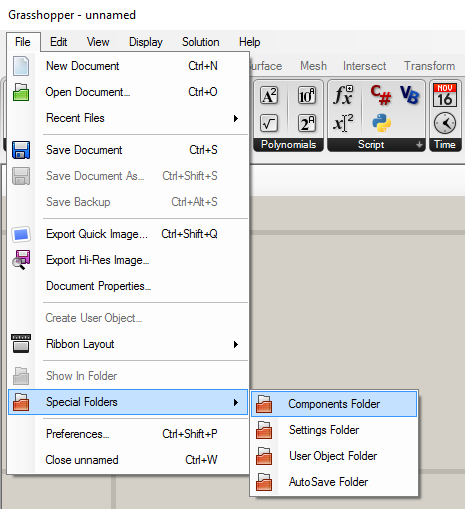

To see the GHPython node you need to restart Grasshopper either by restarting Rhino or typing the GrasshopperUnloadPlugin command in Rhino to shut down Grasshopper and then restart it. If you just close the Grasshopper window it only hides it and does not actually shut it down.

### 2.3 - Getting the repo

Once you have installed the dependencies, all you need to run *Discover* is a local copy of this repository. If you are familiar with GitHub, you can fork this repository and clone it to a local folder of your choice. If you don't want to use Github you can simply download the repository by clicking on the green "Clone or download" button above and clicking on "Download ZIP". Then unzip the files to a local folder of your choice.

The repository includes several example files which you can use to test Discover, or modify for your own projects. Each project must have as a minimum a `.gh` Grasshopper file which describes the parametric model, and a `.py` Python script which describes and runs the optimization job. In order for *Discover* to work, both of these files must stay in the main repository folder. The repository includes two template files, `template.gh` and `run-template.py` which you can use as a starting point for your own projects.

## 3. Setting up the model

Start by creating a new Rhino project. Then type 'Grasshopper' to launch the Grasshopper window and load in the `template.gh` file. 

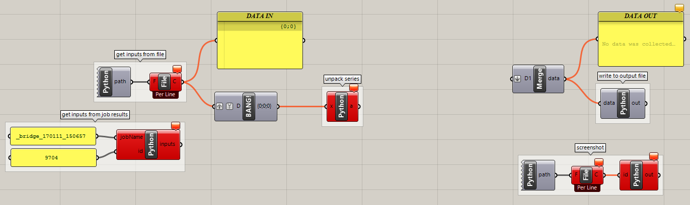

This template file contains a number of nodes that allow it to work with *Discover*. The easiest way to make your Grasshopper file work with *Discover* is to start with this template file. Alternatively, you can also copy and paste these nodes into an existing file.

The first set of nodes [1 in image above] listens for input commands from *Discover*. When a job is running, a list of inputs for each design will be loaded into the 'File' node, and the 'BANG!' node splits them into separate pieces of data that you can plug in as inputs into your model. There is also an additional Python node for unpacking 'series' or 'sequence' type inputs into your model (more on these input types later).

The second set of nodes [2] will load in inputs from a specific design in a previous job. You must supply both a job name and a design ID for the node to work.

The third set of nodes [3] gathers the outputs from your model and sends them to discover. You should connect every output into a separate input of the 'Merge' node.

The four set of nodes [4] controls the automated exporting of screenshots for each design during a job. You don't have to connect anything to these nodes, but have to have them somewhere on your canvas for the screenshot feature to work.

Let's add some nodes to this file to define a simple parametric box model with three input parameters to define the box's length, width, and height, and two outputs that measure the box's surface area and volume. For now we can use sliders to specify the inputs so that we can test the model. We will also connect the two output values to the `Merge` node so that they can be passed to Discover. Make sure you you right click on each input of the `Merge` node and select 'Flatten' to ensure that the model outputs do not get placed on different data branches and that the order of the outputs is maintained (you should see an arrow pointing down next to each of the inputs into the `Merge` node).

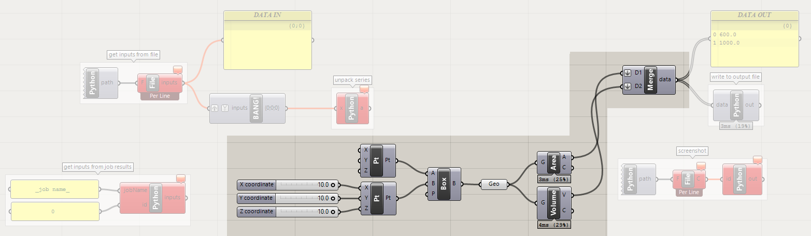

## 4. Setting up the job

Now open the `run-template.py` file in a text editor or IDE of your choice. I recommend using [Sublime 2](http://www.sublimetext.com/2), which is a simple, free, and cross-platform text editor which supports syntax highlighting, autocomplete, and can run python scripts directly in the editing window.

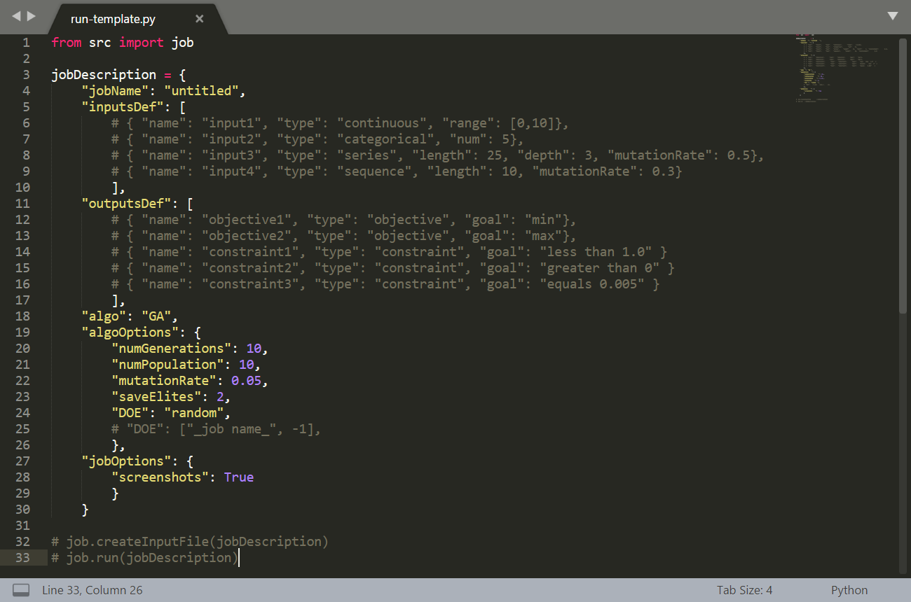

This file shows the basic structure for specifying and running a job with Discover. The first line [line 1 above] imports the job library from the 'src' folder. The second part [lines 3-29] specifies all necessary options for running the job, including the data types for the input and output parameters used by the model, as well as options for the general job and the specific search algorithm. 

The template file contains example code for the different data types and options supported by Discover, which you can modify according to your project's needs. Let's modify this definition to specify three continuous input parameters for our box model, as well as two objectives for the surface area and volume of the box. In this case we want to minimize surface area while maximizing volume.

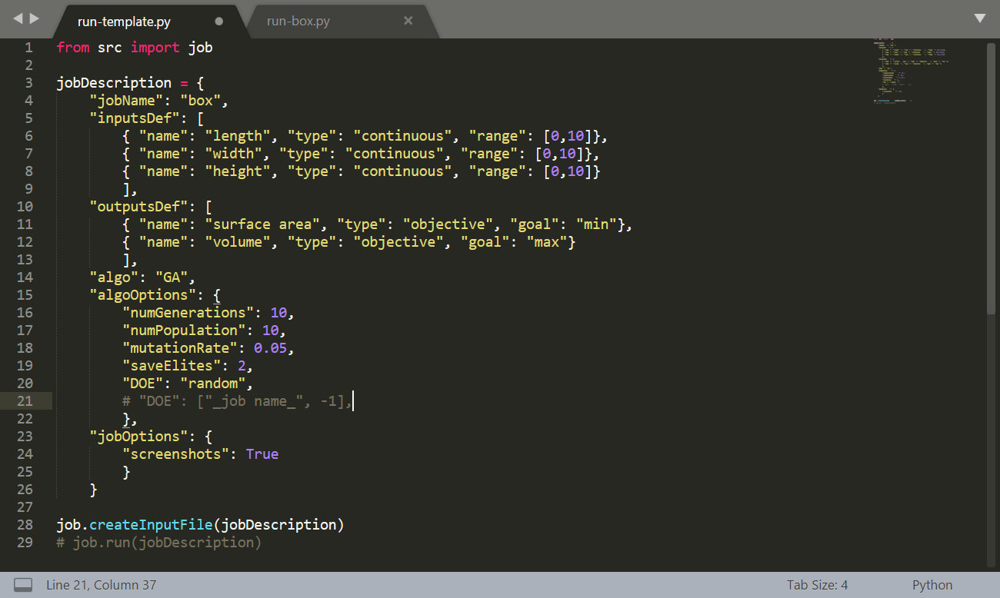

Below the job definition are two lines of code that run the job in Discover. The first line uses the job description to generate a sample input file that can be used to test your Grasshopper setup. The second line runs the actual job. Both of these lines are commented out in the template file so nothing will run by default.

Uncomment the line of code that says:

```python
job.createInputFile(jobDescription)
```

by removing the `#` symbol at the front of the line. In Sublime, you can also press 'Ctrl+/' to comment and un-comment lines. Now run the script to generate a sample input file. You can run the script in Sublime by going to Tools -> Build in the menu bar or by pressing 'Ctrl+B'.

If you now go back to the Grasshopper file you will see that the 'File' node is no longer red because it is able to read the sample input file we just created. You should also see the three input values populating the `DATA IN` panel. To split this data into different streams right-click on the `BANG!` node and select 'Match outputs'. This will create three output nodes, one for each input data. Finally, connect the three data outputs to the three inputs of the `Pt` node that define the box dimensions. Since we are not using a 'series' or 'sequence' type input variable we do not need to use the additional Python node to unpack them. The Grasshopper file is now ready to work with *Discover*, you can save it and keep it open in the background during the next steps.

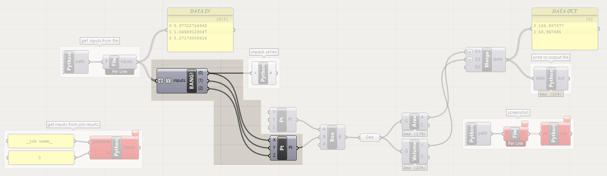

## 5. Running the job

Now that the model is set up and open in Grasshopper, we can run the job in *Discover*. Go back to the `run-template.py` file we worked on earlier. Now comment out the line that says

```python
job.createInputFile(jobDescription)
```

by placing a `#` in front of it and un-comment the following line that says

```python
job.run(jobDescription)
```

Now run the script again, which should start the job. You should see information about the progress of the current job being displayed at the bottom of the Sublime window. If you go back to the Rhino/Grasshopper window you should also see designs being automatically generated. Note that if you have screenshots enabled, Grasshopper will automatically save a screenshot of whatever is visible in the currently active viewport in Rhino, so make sure that you have this view composed the way you want before starting the job, and you don't change the view while the job is running.

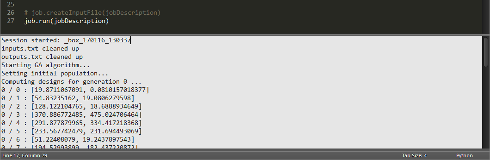

## 6. Exploring results

Every time you start a new job in *Discover*, it will create a new folder combining the job name, the date, and current time to make sure there are never any duplicate folders. Here is the folder for the job we just ran:

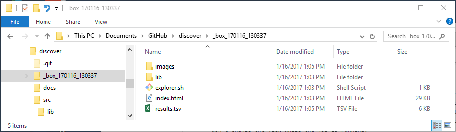

Inside each job folder you will see a standard set of files that allow you to explore the results of the job. If you have enabled the screenshots feature, you will see an `images` folder containing an image for each design explored. You will also see a `lib` folder which contains the javascript libraries needed to run the explorer. 

In the main folder you should see a file called `results.tsv`, which is the database of each design explored during the job. This is a spreadsheet document formatted with designs along the rows, and information about each design such as its unique ID, generation number, and all of it's inputs and outputs along the columns. The `.tsv` extension stands for 'tab separated values', meaning that values in different columns are separated by a 'tab' character. You can open this file directly in a text editor or spreadsheet editor like Microsoft Excel to look through the designs.

Finally, each job folder also contains "index.html" file, which is used to launch the *Explore* interface. The file can be directly opened in the Firefox browser (by right-clicking and selecting Open with Firefox), or viewed in any browser using a local server. To make this easier, each job folder also contains a Batch file called `explorer.bat` which will automatically start a local server using Python, and launch *Explorer* in your default browser.

Start the *Explore* interface by either opening the `index.html` file in Firefox or double-clicking on the explorer.bat file. This should launch the interface in the web browser:

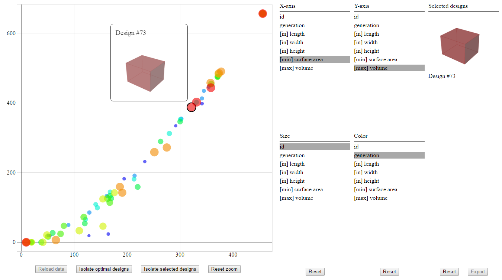

This interface allows you to explore the 'design space' of your model by looking at all the designs explored during the optimization job according to different pieces of data. On the left side is the main scatter plot window which shows each feasible design as a solid circle, and each non-feasible design as a hollow box. Non-feasible designs will only occur if you are using constraints in your job setup, so in this case we only have circles.  The scatter plot interface has very flexible pan and zoom capabilities. You can pan and zoom along both axes by clicking and dragging and using your mouse's scroll wheel anywhere in the scatter plot window. You can also pan and zoom along a single axis at a time by clicking and dragging or scrolling over the axis label text.

The four text boxes immediately to the right of the scatter plot are automatically loaded with all the data for each design. Here you can select which data will be represented along the four dimensions of the scatter plot (the position of each circle on the x and y axis, its color, and its relative size).

As you hover over each circle you will get a tooltip which shows the design's ID and its screenshot (only if you enabled this feature for the job). You can click on the circle to select the design, which will put a dark outline around it and will place that design in the text box on the far right.

Along the bottom row are a series of buttons which are described below:

- *Reload data* - not currently implemented
- *Isolate optimal designs* - Isolates only the designs which are not dominated by any other designs in the set. If you are optimizing for a single objective, there will be one single designs which is dominant for that objective. With multiple objectives, however, you will typically get a range of optimal designs which perform better in some objectives and worse in others. Isolating these designs gives you a better picture of the tradeoffs between your optimization goals, and will help you make further decisions in choosing the final design. For a further discussion of optimality in multi-objective optimization problems you can consult [this article](https://en.wikipedia.org/wiki/Pareto_efficiency).
- *Isolate selected designs* - this isolates only the designs currently selected
- *Reset zoom* - resets the pan and zoom of the scatterplot
- The three *Reset* buttons reset the selection for the color and size dimensions (in case you want to keep the color or size of circles in the scatter plot constant) as well as the pool of selected designs
- *Export* - not currently implemented

## Input types

*Discover* is set up to handle different types of input data according to what is needed by the CAD model. Four types are currently implemented as described below, although more types can be integrated by providing the necessary operators for the GA algorithm (more documentation will be provided for this in the future).

- **Continuous** - This describes a single value as a continuous number, for example: 4.2. It should be used for parameters that are continuous in nature, for example distances where a value of '4.2' has some relationship to '4.1' and '4.3' because it is in between them. Continuous inputs have a "range" option which specifies the parameter's minimum and maximum allowed values.
- **Categorical** - This describes a single value as a choice among a set of discrete options. It encodes this choice as an integer (whole number) starting with 0, but can be used to represent any categorical information. For example, you can use this input type to choose among a set of animals ['dog', 'cat', 'horse', 'zebra']. In this case the 'dog' will be represented as 0, the 'cat' as 1, etc., and the translation can be done in the model. This input type should be used for non-continuous categorical parameters, where different options don't have any continuous relationship to each other, for example where 'cat' has no relationship to 'dog' or 'horse' just because it is next to them in the list. Categorical inputs have a "num" option which specifies how many categories exist.
- **Series** - This describes a list of categorical-type inputs - you can think of it as a 'series of options'. You can also think of it as a number whose base is the number of possible categories, and number of digits is the length of the series. For example, a series of 4 choices with 2 possible options can be thought of as a four digit binary number (0110), where each digit encodes the choice for that member of the series. This input type can be used with 'state-change' type problems where you have an array of items which can take on one of several different forms (for example a facade designs where each facade element can be on of 3 types). Series inputs have three options - "length" sets the length of the series, "depth" sets the number of options, and "mutationRate" sets how much of the series is changed during each mutation (betwween 0 for no change, and 1.0 for complete change).
- **Seqeunce** - This describes an ordered sequence of a list of items (also called a [permutation](https://en.wikipedia.org/wiki/Permutation)). The sequence is represented as a list of integers starting with 0 which indicate the position of the items (for example [2,1,0]). This input type can be used for solving sequencing problems such as the ['travelling salesman problem'](https://en.wikipedia.org/wiki/Travelling_salesman_problem) where a set of options must be executed in a certain order. Sequence inputs have two options - "length" sets the length of the sequence, and "mutationRate" sets how much of the sequence is changed during each mutation (betwween 0 for no change, and 1.0 for complete change).

## Output types

When used with a GA algorithm, *Discover* can optimize for both objectives and constraints:

- **Objective** - specifies a goal of the optimization - the output that the algorithm will either try to minimize or maximize during the optimization. Objectives have a "goal" option which specifies whether the value should be minimized ("min") or maximized ("max").
- **Constraint** - specifices a particular condition that must be preserved in the model. Any designs which do not meet these conditions will be penalized in the selection process and will thus be less and less likely to occur in the design set. Constraints can be one of three types:
  - "less than x" means that a working design needs to have the variable less than or equal to x
  - "greater than x" means that a working design needs to have the variable greater than or equal to x
  - "equals x" means that a working design needs to have the variable exactly equal to x

## Supported algorithms

Currently *Discover* supports to algorithms:

- **random** randomly creates and analyzes a set of designs. It has one option - "numPopulation" which specifies the number of designs that will be generated.
- **GA** is a basic multi-objective evolutionary algorithm that applies concepts from evolutionary theory to create better performing designs over time by analyzing and breeding several 'generations' of designs. It takes the following options:
  - "numGenerations" - specifies the number of generations the algorithm will create
  - "numPopulation" - specifies the number of designs created in each generation
  - "mutationRate" - sets the global mutation rate, which is the percentage of generated designs which will undergo random mutation (0.0 - 1.0). Higher values favor random exploration of the design space at the risk of a slower convergence on the optimal designs.
  - "saveElites" - specifies the number of top-performing designs which will be carried over into the next generation without cross-over or mutation. This number must be less than "numPopulation". Lower values favor exploration at the risk of losing high-performing designs, while higher values favor exploitation of known good designs at the risk of diversity.

## License

This software is distributed under the GNU/GPL license. It can be used freely for non-commercial purposes, and may be redistributed as long as attribution is provided back to the original author and any derivative work is given the same license. Please see the [LICENSE](https://github.com/danilnagy/discover/blob/master/LICENSE) document for more information.
